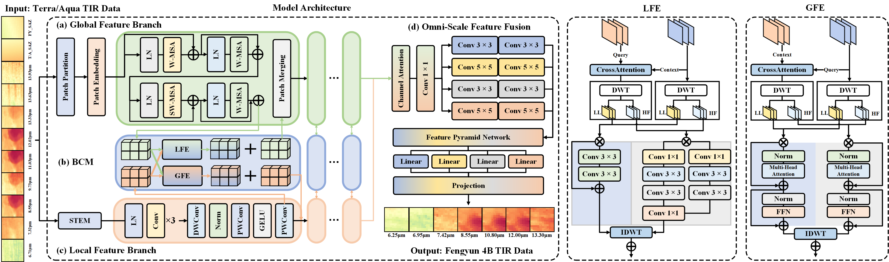

# The reposity for

**OMNIXNET: HIGH-RESOLUTION FY-4B RECONSTRUCTION VIA CROSS-SATELLITE SPECTRAL MAPPING**

# Usage

## step 1

install the requirement dependencies
`pip install -r requirement.txt`

## step 2

inplement your own dataset in ./data_provider/data_loader.py and register the dataset in ./data_provider/data_factory.py

## step 3

inplement your own model in ./models and register the model class in ./exp/exp_basic.py

or just use our OMNIXNET

## step 4

run the ./scripts/omnixnet.sh or your own scripts
